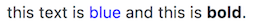

# ansi-markup  

## Description

Convert easy to read text formatting markup to [ANSI SGR escape codes](https://en.wikipedia.org/wiki/ANSI_escape_code). Makes it easy to embed rich text formatting and color inside text that will be displayed in the terminal.

For example: 

"this text is {blue}blue{/blue} and this is {bold}bold{/bold}."

Will look like this on the cli:

>  


## Installation

Add this library to your current Node.js project using npm:

```
npm install --save ansi-markup
```

Or, checkout the source:

```
git clone https://github.com/tcowley/ansi-markup
```

## Basic Usage

```javascript
# sample.js

var ansiMarkup = require('ansi-markup');
var input = "this text is {blue}blue{/blue} and this is {bold}bold{/bold}.";
var output = ansiMarkup(input);
console.log(output);
```

Run on the command line: 

```bash
$ node sample.js
```

This example will output:

>  


If you redirect output to a pipe or file, the markup tags will simply be stripped from the output: 

```bash
$ node sample.js > foo.txt  
```

The contents of foo.txt will be unformatted: 

> this text is blue and this is bold.


You can however force the codes to be rendered by using `forceRender=true`:

```javascript
# sample.js

var ansiMarkup = require('ansi-markup');
var input = "this text is {blue}blue{/blue} and this is {bold}bold{/bold}.";
var options = {forceRender: true};
var output = ansiMarkup(input, options);
console.log(output);
```

```bash
$ node sample.js > foo.txt  
```

The contents of foo.txt will now be: 

>  


## Options

| Option | Value | Description |
| ----- | ----- | ------- | 
| forceRender | boolean. default false | forces tags to be converted to ANSI SGR codes. tags are replaced with ANSI SGR codes when the code is run in a TTY context; eg, output is direct to screen. however, tags are simply removed when the code is not run in a TTY context; eg, output is redirected to file, or piped to another process. setting `forceRender = true` will force all tags to be converted to ANSI SGR codes. |


## Markup

The markup is designed to be easy to use. 

##### How it works:

* Markup tags are used in pairs. An opening tag and a closing tag. Text in between tags will have the style described by the tag.
* Tags can be nested or overlapped, no problem.
* Closing tags are not required. If omitted, a closing tag is implicitly added to the end of the string.
* Closing tags with no matching opening tag have no effect and are simply removed.
* Double the leading '{' to escape any markup tag. A side effect of this is that every double '{{' in the input will be replaced with a single '{'!.


##### Fancy Text 

|  Tag | Description |
| ----- | ------- | 
| {bold}{/bold} | makes the enclosed text bold |
| {underline}{/underline} | underlines the enclosed text |
| {blink}{/blink} | makes the enclosed text blink. super annoying and effective | 

##### Text Color

|  Tag | Description |
| ----- | ------- | 
| {black}{/black} | sets the foreground color of enclosed text to black |
| {red}{/red} | sets the foreground color of enclosed text to red |
| {green}{/green} | sets the foreground color of enclosed text to greeen |
| {yellow}{/yellow} | sets the foreground color of enclosed text to yellow |
| {blue}{/blue} | sets the foreground color of enclosed text to blue |
| {magenta}{/magenta} | sets the foreground color of enclosed text to magenta |
| {cyan}{/cyan} | sets the foreground color of enclosed text to cyan |
| {white}{/white} | sets the foreground color of enclosed text to white |
| {grey}{/grey}   | sets the foreground color of enclosed text to grey. Alternate spelling {gray}{/gray} works too. |
| {default}{/default} | sets the foreground color of enclosed text to default terminal foreground color |

##### Background Color

|  Tag | Description |
| ----- | ------- | 
| {bgblack}{/bgblack} | sets the background color of enclosed text to black |
| {bgred}{/bgred} | sets the background color of enclosed text to red |
| {bggreen}{/bggreen} | sets the background color of enclosed text to green |
| {bgyellow}{/bgyellow} | sets the background color of enclosed text to yellow |
| {bgblue}{/bgblue} | sets the background color of enclosed text to blue |
| {bgmagenta}{/bgmagenta} | sets the background color of enclosed text to magenta |
| {bgcyan}{/bgcyan} | sets the background color of enclosed text to cyan |
| {bgwhite}{/bgwhite} | sets the background color of enclosed text to white |
| {bgdefault}{/bgdefault} | sets the background color of enclosed text to the default terminal background color |

##### Specials

|  Tag | Description |
| ----- | ------- | 
|  {inverse}{/inverse} | swaps the current foreground and background color of the enclosed text |
|  {reset}{/reset} | resets **all** styles of the encosed text to their default values |


## Tests

Tests are run automatically using Travis CI, but you can run them yourself quite easily.

```bash
$ git clone https://github.com/tcowley/ansi-markup
$ cd ansi-markup
$ npm install
$ npm test

// test output displays here
```


The project is using [Tape](/substack/tape) for writing tests. For a small project like this, tape is _very_ easy to use.

## License

[ISC](https://opensource.org/licenses/ISC)


